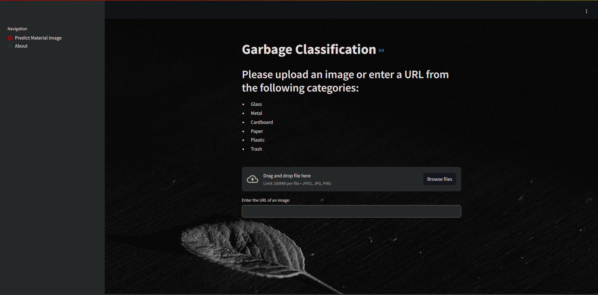

# Garbage_Classification





## Environment Setup (running on codespaces)
To run this project on codespaces without cloning it on your local machine, follow these steps:

### Step 1: Set up the Python environment
To set up the Python environment, run the following command after cloning the repository:

```bash
bash setup_env.sh
```


### Step 2: Run the model
```bash
streamlit run main.py
```

## Environment Setup (running on local machine)
To run this project on your local environment like conda , follow these steps:

### Step 1: Set up the Python environment
conda environment with python=3.10
```bash
conda create --name env_name python=3.10
```
activate your environment
```bash
conda activate env_name
```
install pip using conda 
```bash
conda install pip
```
install packages
```bash
pip install numpy
pip install streamlit
pip install pillow
pip install keras
pip install tensorflow
```

### Step 2: Run the model
```bash
streamlit run main.py
```
